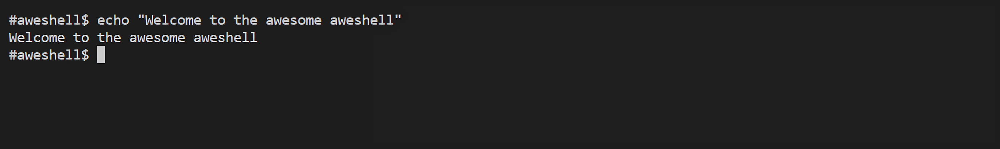

# SIMPLE SHELL

## Overview


Welcome to my shell program. I've titled this shell `aweshell` because it's awesome!!!

This project is a part of my education at ALX SE. My task was to create a shell program
from scratch in C.

As a result, I have tried my best to use as little of the C standard library as possible.

The project comprises of several files which contain functions that aid the operation of the shell. A lot of the functions are my personal implementation of common functions in the C library.
## Installation

On linux the project can be compiled using gcc via

```bash
gcc *.c -o aweshell
```

## Usage

```bash
./aweshell

aweshell$ echo "hello world"
hello world
```

## Commands Handled

The shell currently supports common shell commands like
`echo`, `cp`, `rm`, `mv` etcetera and built-in like `exit` and `env`. Variable replacement and Comments are also handled.


```bash
aweshell? echo $USER # Welcome to my shell
aweayo
```

However, the following commands are supported yet

* Chande Directory - `cd`
* Command Seperators - `;`
* Logical Operators - `&&,` `||`
* alais
* setenv and unsetenv


## License

[MIT](https://choosealicense.com/licenses/mit/)
